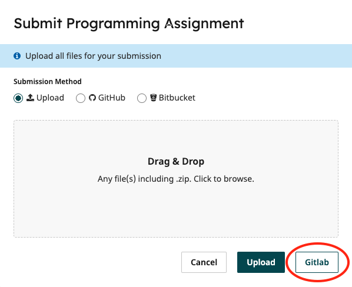

# Exercise: Caching Simulation

This exercise asks you to explore different approaches to caching, in
particular alternative mechanisms for identifying which elements
should be evicted from the cache when the cache is full and a new item
needs to be stored.

The exercise involves implementation of a cache that stores the
results of memory lookups, with the aim of reducing the number of
lookups that are needed during a sequence of memory accesses.

The exercise is *summative* and contributes towards your unit
mark. The work should be your own individual work. Do **not** share
solutions or submit code copied from the web. We will run comparison
software on submitted code.

A memory lookup takes a location, here modelled as an integer, and
returns some data, here modelled as a string of hex digits.

Memory is simulated by an array, which is passed in to the constructor
of the memory object. Subsequent lookups will then look in this array
to determine the "values" that are held at a particular location. You
should make no assumptions about the content of this array or the ways
in which locations map to elements of the array. 

The memory class provides a ```lookup``` function. This takes a memory
location (an address) and returns the data that is at that
address. A count is kept of each memory "hit" (i.e. each time we call
the lookup on the memory object). 

You are given the following files:

* ```memory.py``` Memory simulation. Defines a class ```Memory```.
* ```cache.py``` Within this file there are several classes defined, including
  ```CyclicCache```, ```LRUCache```, ```MRUCache```, and ```LFUCache```.
* ```utilities.py``` Utilities including creation of sample "memory". 
* ```test_simple.py``` Sample unit tests 
* ```harness.py``` Sample driver file 

There are some useful functions defined in ```utilities.py``` that
will generate some sample memory data. These are used in the harness.

Comments in the code provide some more insight into the structure and
the tasks required. 

## Running the code

There is some simple harness code that will allow you to inspect the results of running
your implementation. 

For example, try running:

```
user@computer> python3 harness.py < in-10.txt
```

This will use the default Cache implementation (which does no caching)
and should result in something like the following:

```
user@computer> python3 harness.py < in-10.txt 
001, 0, eccbc87e
002, 1, c81e728d
003, 2, c4ca4238
004, 3, cfcd2084
005, 4, 8f14e45f
006, 5, 1679091c
007, 4, 8f14e45f
008, 6, e4da3b7f
009, 1, c81e728d
010, 2, c4ca4238
Model: Cache
10 Accesses
10 Memory Hits
0 Cache Hits
```

This is reporting that in step ```001```, location ```0``` was
accessed, returning ```eccbc87e```. In step ```002```, location
```1``` was accessed, returning ```c81e728d```. In step ```009```,
location ```1``` was accessed, again returning the value
```c81e728d```. In this case, in total there were ```10``` memory
accesses. There is no caching, so every request will result in a
memory access and there are no cache hits. 

To use an alternative strategy, try:

```
user@computer> python3 harness.py -s LRU < in-10.txt
```

This will use the LRU implementation. Note that in the skeleton code
given, this will return *None* to all lookups. Your task is to provide
the appropriate implementation.

## Testing

A few simple tests are defined in ```test_simple.py```. You can run them using:

```python3 test_simple.py```

or

```python3 -m unittest -v test_simple.py```

if you'd like a little more information.

The code uses python's ```unittest``` framework to run tests against
the code. Unit testing is a common mechanism that's used in software
engineering to test the component parts of a system before
integration.

There is comprehensive documentation on the ```unittest``` framework
here:

<https://docs.python.org/3/library/unittest.html>

In brief, a unit test is defined as a class with a ```setUp()```
method that performs some initialisation. A ```tearDown()``` method
may also be used to clean up resources -- this is not used in these
simple examples. A hierarchy of test cases can be defined, allowing
for generic setup code.

By default, test methods are then defined in a class with the prefix
```test```. The naming convention allows the test runner to determine
which methods should be run as tests. There are other, more
sophisticated mechanisms that can be used to define tests, but this
suffices for our particular example. Within a test, methods such as
```assertEquals()``` are used to make assertions about the expected
results. For example, an assertion

```
assertEquals(someValue,0)
```

will **fail** if someValue is not equal to 0.

Note that some of the tests in ```test_simple.py``` are designed to **fail**
on the given code skeletons. For example, in```TestCaseNull```,
```test_cyclic``` performs the following on the ```CyclicCache```
implementation:

1. a call to ```lookup(0)```, requesting the contents of memory
  location 0. It then checks that this value is non-null. With the
  stub implementation, this test fails. 

If you provide a correct implementation for the cache, this test
should then pass. This is a rather simple example of *test driven
development* -- the tests have been defined before development
takes place, and can be used to repeatedly track progress as code is written. 

These tests are in no way comprehensive and simply provide some checks
that the code runs and returns results in an expected format. Code
that fails tests in ```test_simple.py``` is unlikely to get a passing mark.

We recommend that you develop your own tests, either using the
```unittest``` framework or hand-crafted cases. Share them with your
colleagues. Treat this as a challenge: can you design a test that will
expose an error in someone else's code? Please note the distinction
between sharing **tests** and sharing **implementations**. In this
context, sharing tests is acceptable and may help you in collectively
understanding the problem space. Sharing *implementations* for
individual assessment such as this one is considered as collusion and
thus academic malpractice.

## The Task

The task is to provide an implementation of the
```lookup(address)``` operation which takes an address ```n``` and
returns the value at address ```n```. The operation should use the
appropriate caching strategy to minimise memory accesses. Note that
each entry in the cache thus stores an association between an address
and the data that was stored at that address. 

Your implementation of the caches shouldn't make assumptions about the
implementation of ```lookup()``` in the ```memory.py``` class. Your
code may eventually be run or tested against a **different**
implementation of ```memory.py```. 

The basic operation of the cache should be as follows.

* When an lookup is requested, check if the location is in the
  cache. If it is, return the appropriate value and increment the
  count of cache hits. 

* If the location is not in the cache, call ```super().lookup``` which
  will retrieve the data from 'memory'.

* The value should then be added to the cache. If the cache is full,
  then an entry needs to be evicted. The appropriate strategy should
  be used to determine which entry to evict.

Depending on the cache strategy, there may also be some housekeeping
that needs to be done. 

In order to simplify the exercise, there is no need to check if the
cache has been invalidated or worry about flushing the cache -- you
can assume that calls to the memory lookup will always return the same
answer (and thus if it's in the cache it's safe to use the cached
value). Note that you shouldn't be changing the value of
```memory_hit_count``` in the cache implementations. This is taken
care of in the ```Memory``` class. You *will* need to keep track of
the cache hits: variable ```cache_hit_count``` should be incremented
each time there is a request for a location that is in the
cache. These values (as returned by the methods
```get_memory_request_count()``` and ```get_cache_hit_count()``` will be
used in the tests which will be run against your code.

There is also a variable ```cache_hit_flag``` with an associated
accessor. This should be set to ```True``` if the last access hit the
cache and ```False``` otherwise. The results of this will also be used
in tests.

Implement solutions using:

1. a Cyclic strategy.
   * Assume slots ```1,...,N``` in the cache.
   * Keep track of the next slot in the cache to be used (starting
     with ```1```).
   * When an value is cached, we increment our slot count to use the
   next slot.
   * Once all slots have been filled, go back to slot ```1``` and
     cycle round. 
2. an LRU (least recently used) strategy.
   * Assume ```N``` slots.
   * Keep track of how recently each slot has been used (accessed or stored).
   * If the cache is full and a new value needs to be stored, we
     remove the entry from the slot that was least recently used and replace with
     the new value.
3. an MRU (most recently used) strategy.	 
   * Assume ```N``` slots.
   * Keep track of how recently each slot has been used (accessed or stored).
   * If the cache is full and a new value needs to be stored, we
     remove the entry from the slot that was most recently used and replace with
     the new value.
4. an LFU (least frequently used) strategy.
   * Assume ```N``` slots.
   * Keep track of how many times each item in the cache has been
     requested and the order in which they have been added to the cache.
   * If the cache is full and a new value needs to be stored. we
	 remove the entry that is least frequently used, i.e with the
	 smallest number of requests. If there is a "tie", then evict the
	 item that was least recently used, i.e. the item that has seen
	 the longest time since a request. 

Each of these strategies should be implemented in the appropriate
class.

Note that the cache size is variable. By default it is 5, but there is
an argument to the constructor that provides a size. This will be a
non-negative integer. Your implementation needs to take this in to
account.

Do **not** make any changes to the implementation of ```memory.py```. Nor
should you make any assumptions about the results that ```memory.py```
returns. Your code may run against an implementation of
```memory.py``` that has the same interface, but a different
implementation.

## Code Style

Your code should conform to
[PEP8](https://www.python.org/dev/peps/pep-0008/) guidelines. We will
use [pycodestyle](https://pypi.org/project/pycodestyle/),
version 2.11.1 to check this.

# Submission

The code will be autograded using a system called
**GradeScope**. Gradescope will pull code from your gitlab repository
and then run a sequence of tests, generating a mark. 

You should check that the results of the tests in ```test_simple.py``` are as
expected: this is where basic issues with your code such as syntax
errors or the use of additional libraries may be picked up.

On submission, Gradescope will run a set of tests and the results will
be reported. These will include similar tests to those in
```test_simple.py``` and will give you an idea that your code is
working as expected. Check that there are no syntax errors or missing
libraries being reported by Gradescope. 

Gradescope will also run a series of additional, hidden
tests against your code, checking that the caching strategies are
performing as they are supposed to. The results of these will
**not** be reported to you but will be used to determine a mark.

You should be producing test data yourself that will give you
confidence that your implementations are correct and any corner cases
are covered.

On the submission page for the exercise, you will see an option to
submit via gitlab.



When you do this for the first time, you will be
asked to authorise the application. Once you have done this, you will
be able to select a repository and branch to submit. The code on that
branch will then be pulled by Gradescope and tests will be run.

Note that you will receive some feedback on test performance, but the
results of all the hidden tests, and thus your final mark will not be
visible until after the submission date. You can continue to develop
code and resubmit as many times as you wish before the deadline: tests
will be rerun on re-submission.

You will see that if you simply submit the code skeletons that we have
provided without making any changes, a number of tests will pass (and
some will fail). This allows you to check that the submission
framework is working as expected. Note that tests other than PEP8
conformance that are passed by the skeleton are zero-weighted, so
submission of the skeleton code will result in a very low mark.

There are four strategies to implement: each one contributes roughly
one quarter of the available marks.

We suggest you try submitting code before you start making any changes
in order to check that the submission mechanism is working
properly. You can resubmit as many times as you wish before the
deadline. 

Failed tests may give some message or indication as to the issue, for
example ```"Cache hit counts do not match"``` if the number of times
the cache is hit does not match the expected value. 

Do **not** use any non-standard libraries (e.g. libraries that must be
installed via ```pip```). If you do this, the code may fail to run.

Your solution should **not** rely on any python files other than
```memory.py```, ```cache.py``` and ```utilities.py```. If you add
additional files these may not be picked up by the autograder and
tests will fail. 

The test scripts will not be expecting any additional files other than
```cache.py```, ```memory.py``` and ```utilities.py```. If your code
relies on other files, it may fail to run.

If your code does not run, this will be reflected in the feedback for
the initial tests. Code that fails to run will attract a mark of 0. It
is **your** responsibility to check that the autograder has been able
to run your code.

## Stretch Goals (not for credit)

Think about other strategies that could be used in the
implementation.

See <https://en.wikipedia.org/wiki/Cache_replacement_policies> for a
list of possible eviction algorithms. 


